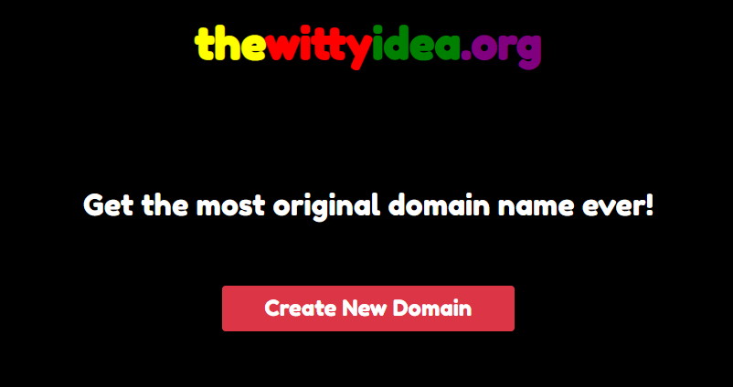

# Domain URL Generator

## About

You will find two code versions on this repo.
The first one, index.html -my favorite one- just uses a randomizer and displays the domains one by one.
The first one, index2.html, is based on for loops and displays a full list of all possible domains.

You can find see the project [here](https://fskarmeta-random-url-generator.netlify.app/)

